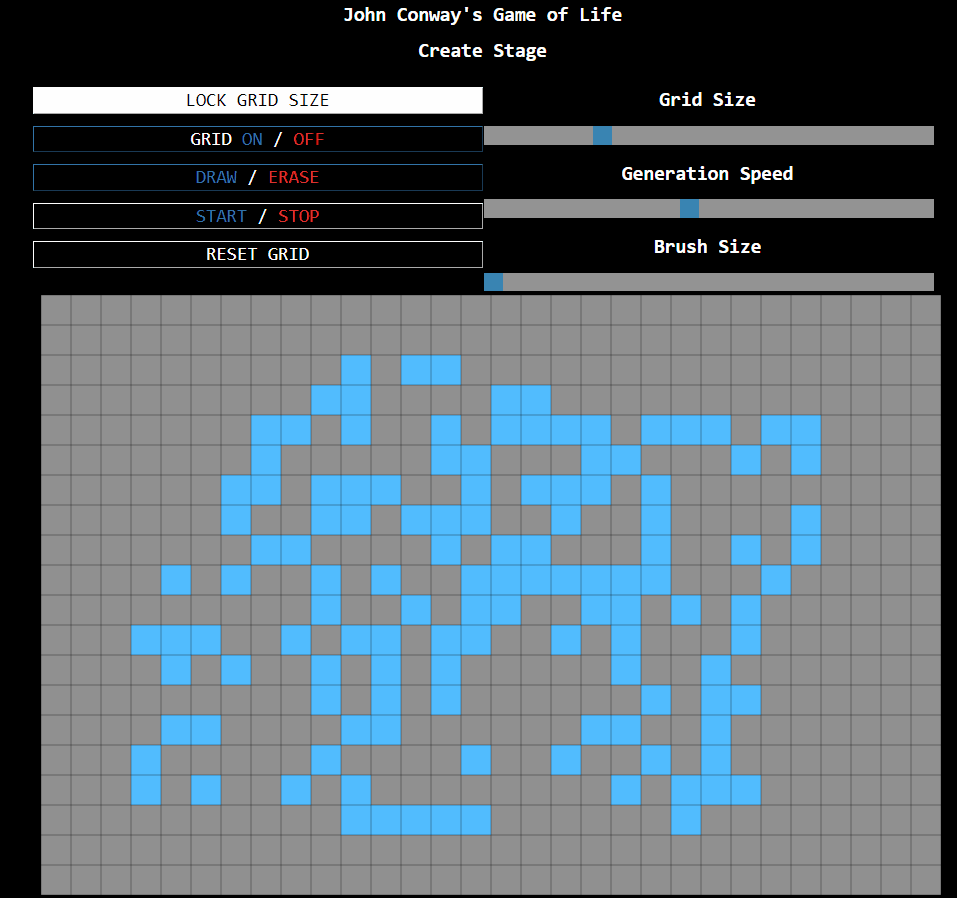

# Conway's Game of Life, Interactive Simulator
The purpose of this project is to create an easy, quick way for\
educators and creators to make specific game of life layouts.\
The website provides a grid on which creators can lay out their designs.\
The simulator can then be run, allowing the creator to observe\
how the simulations reacts to their creation.

## Why p5.js
I chose p5.js as the graphical library for this project for a few reasons.\
Mainly, for ease of use. Admittedly, p5 impressively inefficient, however\
seeing as this project is quite small, I wasn't too worried about performance.\
P5 was a reinterpretation of the original Processing library, specifically\
aimed at web use. This made it my top choice.

## Functionality
Most of the functionality is described in the introduction.html page. However,\
I'll give a brief overview of the features.\
|Feature|
|---|
|Adjustable grid size|
|Toggleable grid overlay|
|Draw your creation|
|Pause/play|
|Adjust generation speed|
|Adjust brush size|
|Generation counter|

## Sample gif

